# Khthon Grave Shapefile Builder

A web UI for digitizing grave boundaries on a satellite map by clicking
vertices, tracking how a grave's outline changes over time via a date
timeline, and exporting real Esri shapefiles per date.

This is a fully static, client-side app (HTML/CSS/JS, no backend, no build
step) so it can be hosted directly on GitHub Pages.

## Features

- Satellite basemap (Esri World Imagery), click to place polygon vertices.
- Right-click a vertex to delete it; undo/clear controls for the active date.
- Timeline: add any number of dates per item, each with its own polygon.
  The date field only offers dates that actually have an
  [Esri World Imagery Wayback](https://livingatlas.arcgis.com/wayback/)
  capture — populated live from Esri's release list, at whatever cadence
  they were actually published (as often as every couple of weeks in some
  periods/regions, months apart in others) — so there's no picking an
  arbitrary date and hoping the imagery is close. Selecting one in the
  dropdown immediately previews that exact capture — even before you click
  "Add date" — so you can browse across time without committing a timeline
  entry for every date you look at. Once added, switching between dates on
  the slider or chip list shows each one's own polygon the same way.
  Through all of this **the map's pan/zoom never changes**, so you stay
  oriented as you move through time.
- Coordinate search box to jump straight to a location — accepts decimal
  degrees, degrees-decimal-minutes, or full DMS, with N/S/E/W as a prefix
  or suffix on either value, common degree/minute/second symbols, and
  almost any separator (comma, space, slash, semicolon). E.g. `40.71,
  -74.01`, `40°42'47"N 74°0'22"W`, or `N 33.87, E 151.21` all work.
- On submit, you're asked whether the grave is **clandestine** or
  **attached to a cemetery**, and required to provide a **description**
  (with a citation for your source) and a **signature** identifying who is
  submitting the item. Grave type is saved into each shapefile's attribute
  table; all four plus a best-effort **nearest city** (reverse-geocoded
  from the polygons' centroid via OpenStreetMap Nominatim) go into a
  `metadata.json` bundled alongside it.
- Submitting generates real `.shp`/`.shx`/`.dbf`/`.prj` files (WGS84,
  EPSG:4326) in the browser via `@mapbox/shp-write`, one shapefile per
  date, zipped together with `JSZip` and downloaded straight to your
  machine — no server involved.
- The sidebar remembers previously submitted items on this device
  (`localStorage`) as a quick reference; the underlying data lives in each
  downloaded zip, not on any server.
- **Review mode**: click **Review zip…** and pick a previously downloaded
  submission zip to load it back into the workspace for editing. The zip is
  validated first (a real zip, a parseable `metadata.json`, and a matching,
  readable shapefile for every date it lists) before anything is loaded, so
  a corrupt or unrelated file is rejected with a specific error instead of
  loading partial data. Vertices are recovered by parsing the real `.shp`
  binary rather than trusting a separate coordinate list, since the
  shapefile is the authoritative record. Item name, grave type, description,
  and signature are pre-filled from the zip's `metadata.json` — edit
  anything (vertices, dates, or the classification fields) and click
  **Submit** to download an updated zip the same way as any other item.

## Usage guide

A full walkthrough of building and submitting one item, start to finish.
Screenshots below were taken from a live run of the app.

### 1. Open the app

You land on a world view of the current Esri satellite basemap. The top bar
has the item name and coordinate search fields; the right-hand side panel
has the (empty) timeline, vertex controls, and previous-items history.


### 2. Name the item

Give the item you're digitizing a short, unique name (e.g. `Site-014`) in
the **Item name** field at top left. This becomes the slug used for the
downloaded filename and is stored in `metadata.json` and every shapefile's
attribute table.

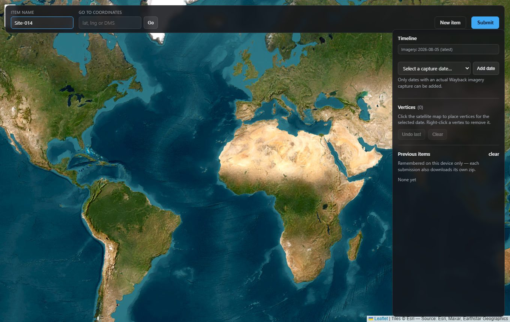

### 3. Navigate to the site

Type coordinates into **Go to coordinates** and click **Go** (or press
Enter) to fly the map there. The box accepts decimal degrees
(`48.8584, 2.2945`), degrees-decimal-minutes, or full DMS
(`40°42'47"N 74°0'22"W`), with or without N/S/E/W hemisphere letters, in
either order — it auto-detects which value is latitude vs. longitude.

A confirmation toast in the bottom-left shows the coordinates it jumped to.

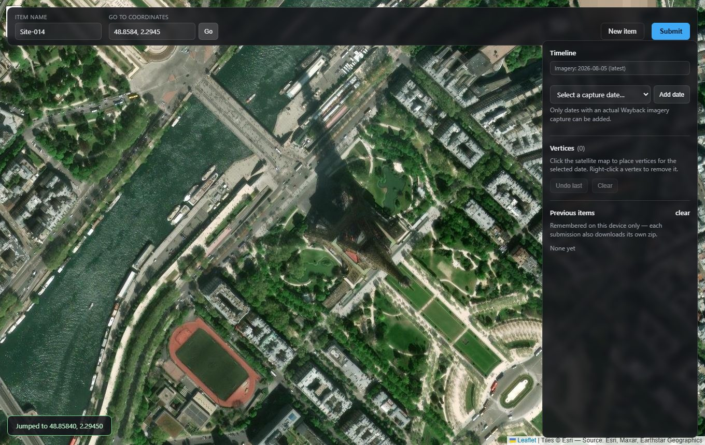

### 4. Add a date and draw the polygon

The timeline's date field is a dropdown of **actual imagery capture
dates** — every option in it is a real [Wayback](https://livingatlas.arcgis.com/wayback/)
release, so you're never guessing at how close your pick is to available
imagery. Pick one and click **Add date**. This:

- Creates a new timeline entry, sorted chronologically among any others.
- Immediately shows that exact capture on the basemap — the **Imagery**
  label at the top of the side panel confirms which date it's showing.
- Makes that date the "active" one — vertices you place next belong to it.
- Marks that option `(already added)` and disables it in the dropdown, so
  you can't accidentally add the same capture twice.

(If Esri's release list can't be reached at all, the dropdown falls back to
a plain date picker with no historical matching — see
[Historical imagery notes](#historical-imagery-notes).)

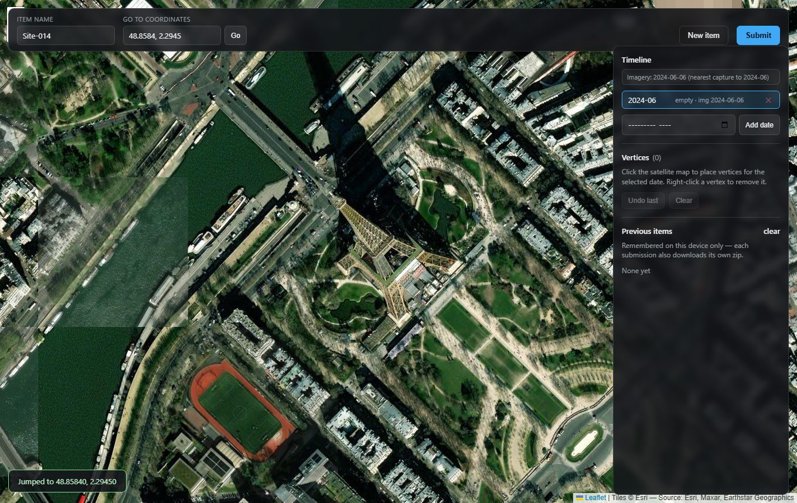

With a date active, **click anywhere on the satellite map** to drop a
vertex. Keep clicking to build up the outline — the app draws a dashed line
after 2 points and fills in a solid polygon once you have 3 or more.

- **Right-click** a vertex to delete it.
- **Undo last** removes the most recently placed vertex.
- **Clear** removes all vertices for the active date.
- The **Vertices** counter in the side panel tracks how many points the
  active date currently has.

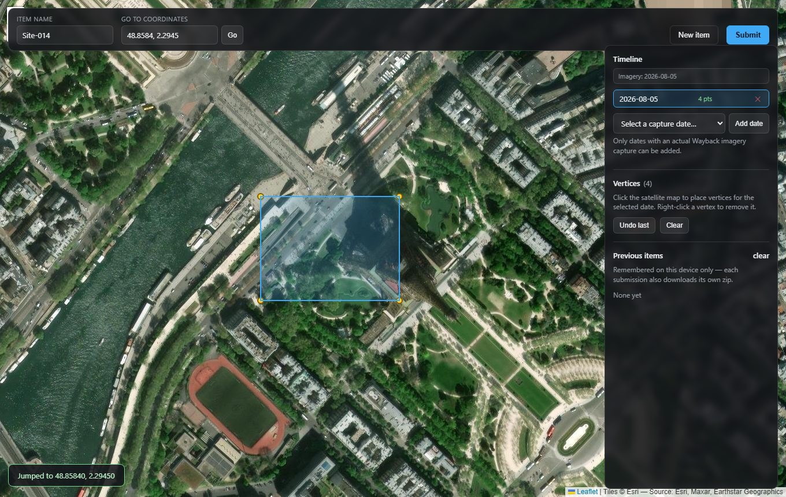

### 5. The timeline panel

Each date gets its own chip showing the capture date and point count
(chips turn green once a date has 3+ points and is ready to submit). Click
a chip to make that date active and view its polygon; click the **✕** on a
chip to remove that date entirely (freeing it back up in the dropdown).

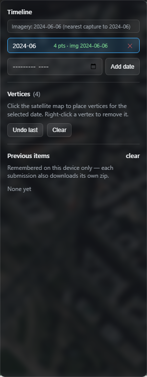

### 6. Track the site across time

Repeat step 4 for as many dates as you want — a grave's outline can be
digitized separately at each available capture it was visible in, e.g. to
show it appearing, growing, or being disturbed. Each date keeps its own
independent set of vertices.

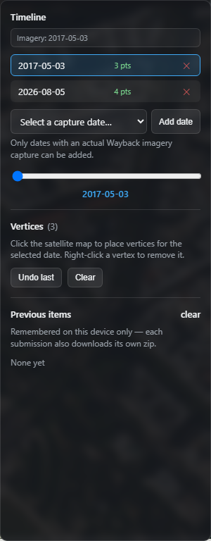

Once there's more than one date, a **slider** appears under the date list.
Drag it (or click a chip) to switch which date is active — this swaps both
the displayed polygon and the satellite imagery to that date's capture.
**The map's pan/zoom never changes** when you do this, so you stay oriented
as you move through time.

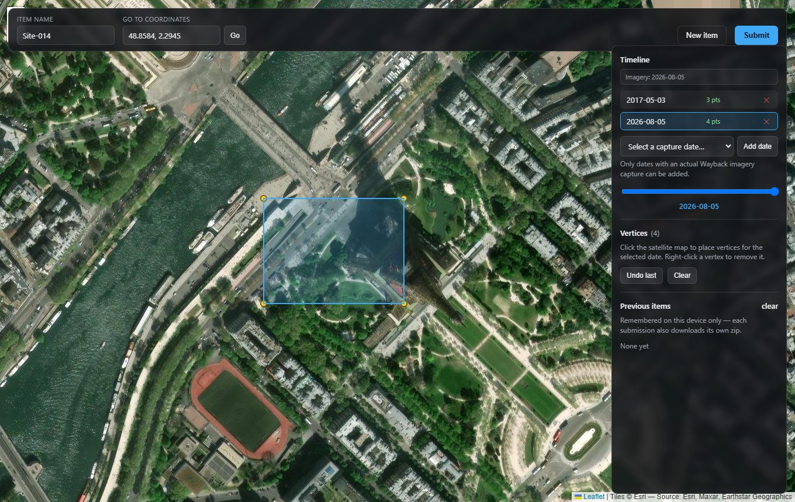

### 7. Submit

Click **Submit** once every date on the timeline has at least 3 vertices
(you'll get an inline error naming any date that doesn't). This opens the
classification dialog:

- **Grave classification** — whether the site is **clandestine** or
  **attached to a recognized cemetery**.
- **Description** *(required)* — a free-text description of the site that
  must include a citation for your source(s) (field notes, imagery
  analysis, a registry record, news reporting, etc.).
- **Signature** *(required)* — the name of the person submitting the item,
  for accountability/provenance.

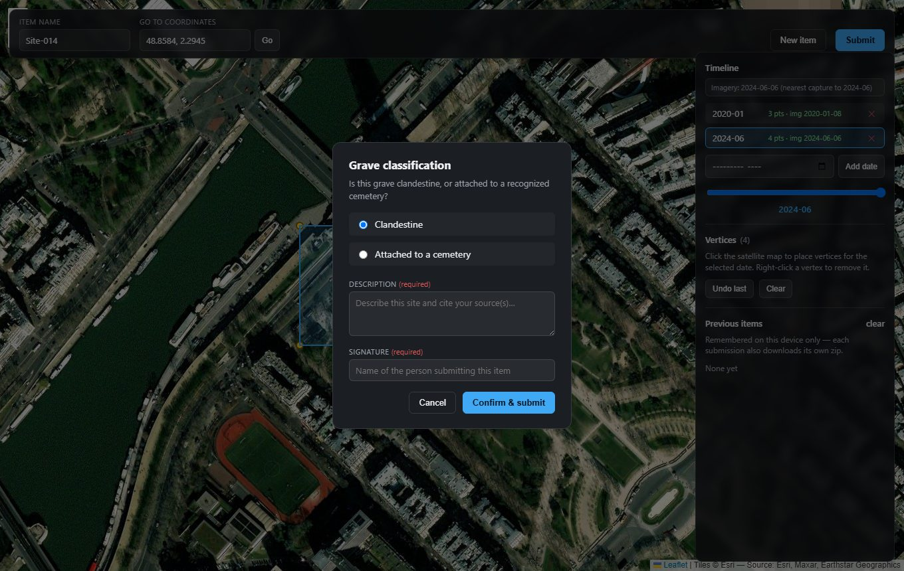

Fill in all the fields — the **Confirm & submit** button won't proceed
without a description and signature.

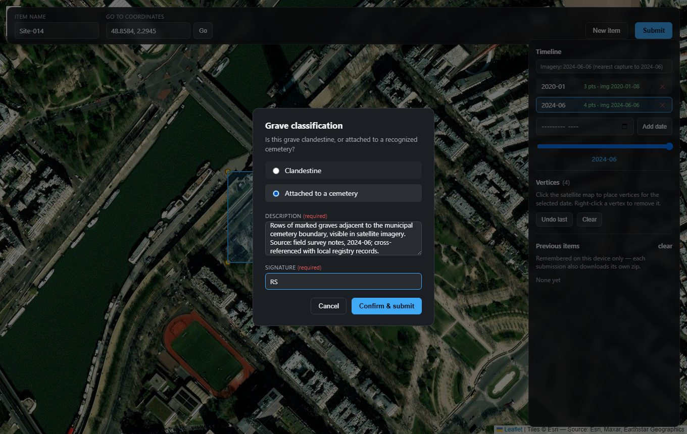

### 8. Confirm and download

Clicking **Confirm & submit**:

1. Builds one real `.shp`/`.shx`/`.dbf`/`.prj` shapefile per date.
2. Best-effort reverse-geocodes the polygons' centroid to a nearby city
   (via OpenStreetMap Nominatim) for the metadata.
3. Zips everything together with a `metadata.json` and downloads it
   straight to your machine as `<item-slug>_<timestamp>.zip`.
4. Clears the workspace (map view untouched) so you can start the next
   item, and adds this one to **Previous items** in the side panel.

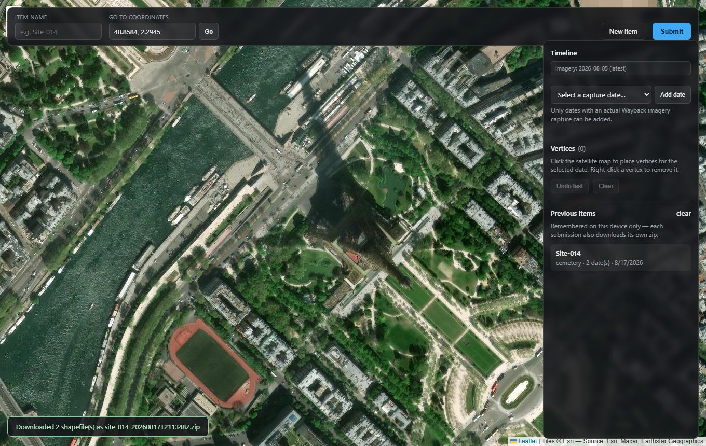

**Previous items** is a per-browser convenience list (via `localStorage`)
so you can see what you've already submitted in this session — the
authoritative data lives in each downloaded zip, not in the browser. Use
**New item** at any point to discard the current in-progress item and start
fresh (it'll ask for confirmation if you have unsaved work), or **clear**
next to Previous items to wipe that local history (downloaded zips are
unaffected).

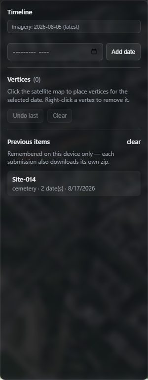

## Run locally

No build step or dependencies to install — it's plain static files. Any
static file server works, e.g.:

```
python -m http.server 8000
```

Then open http://localhost:8000. (Opening `index.html` directly via
`file://` also mostly works, but some browsers restrict `fetch`/module
behavior on `file://`, so a local server is recommended.)

## Deploy to GitHub Pages

1. Push this repo to GitHub.
2. In the repo, go to **Settings → Pages**.
3. Under "Build and deployment", set **Source** to "Deploy from a branch".
4. Pick the branch (e.g. `main`) and folder **/ (root)**, then save.
5. GitHub will publish the site at `https://<username>.github.io/<repo>/`
   within a minute or two.

No further configuration is needed — `index.html` is at the repo root and
all asset paths are relative, so it works whether the site is served at a
domain root or under a `/<repo>/` subpath.

## Output

Each submission downloads a zip named `<item-slug>_<timestamp>.zip`
containing:

- `<date>.shp` / `.shx` / `.dbf` / `.prj` — one shapefile per date, WGS84
  (EPSG:4326), attributes: `item`, `date`, `grave_type`, `created_at`,
  `img_date` (the Wayback capture date the polygon was drawn against — the
  same as `date` for any entry added from the imagery-dates dropdown).
- `metadata.json` — item name, grave type, description (with citation),
  signature, creation time, best-effort nearest city, and each date paired
  with its matched imagery capture date.

## Historical imagery notes

- The timeline's date field is populated live from Esri's Wayback release
  list, so every date offered already has a real capture behind it — no
  nearest-match guessing needed. Coverage cadence is irregular though:
  captures have been published roughly every few weeks to months since
  ~2014, and how frequent/recent they are varies a lot by region, so the
  set of dates available for one site can look very different from another.
- If a capture is missing tiles at your current zoom (common for older
  captures or rural/remote areas), those tiles fall back to a scaled-up
  lower-zoom tile ([Leaflet.TileLayer.Fallback](https://github.com/ghybs/Leaflet.TileLayer.Fallback))
  instead of leaving a blank gap. The imagery label notes "some tiles at
  lower resolution" when this happens.
- The release list is fetched live from Esri's config endpoint on page
  load. If that fetch fails (offline, endpoint unreachable), the date field
  falls back to a plain date picker with no historical matching — the
  basemap stays on current imagery regardless of which date you pick, and
  a status message says so. Everything else still works.
